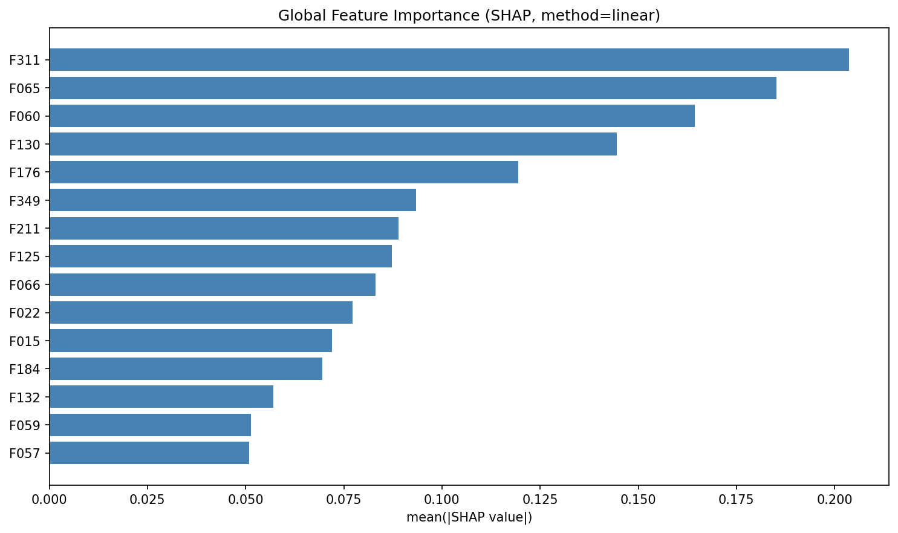
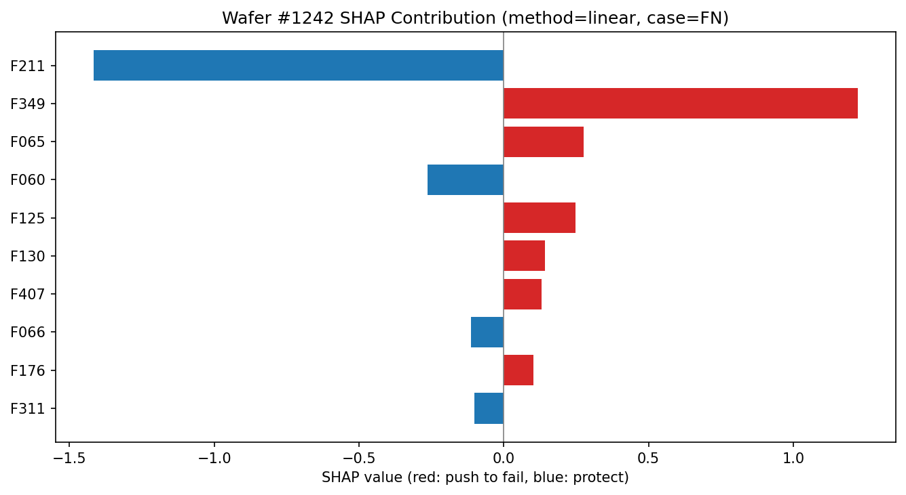

# SECOM 半导体失效分析系统

识别半导体制造过程中的低良率风险晶圆，定位关键工艺参数候选，支撑失效分析与工艺优化。
基于 UCI SECOM 数据集（1567 片晶圆、591 维传感器特征、6.64% 失败率）的完整工程实现。

## 核心成果

| 维度 | 数据 |
|---|---|
| 数据清洗 | 539 个特征含缺失、总缺失率 4.70% → 中位数填充 + 标准化 |
| 特征筛选 | F 检验、互信息、RFE、随机森林四方法综合排名：591 → 40 关键特征 |
| 模型评估 | 岭分类器测试集 BER=0.257 / 召回率=0.714 / AUC=0.811 |
| 可解释性 | SHAP 全局重要性 + 单晶圆 TP/FN 失效归因，自洽校验偏差 <1e-15 |
| 可复现性 | 基线 21 项指标通过 tolerance=0.01 回归校验（当前锁定环境差值 0.0000）；pytest 19/19 |

## 为什么这样设计

### 1. 评估指标选择：BER 而非准确率

失败率 6.64% 的极度不平衡场景中，准确率容易被多数类主导。选用 **平衡错误率（BER）** 作为核心指标：
```
BER = (假正率 + 假负率) / 2
```
这反映工业场景下"宁可误报也不能漏检"的实际权衡——漏检一片低良率晶圆的后续损失远高于虚报一次。

### 2. 多方法交叉验证的特征筛选

不依赖单一方法，而是用四种独立方法各自排名，取平均排名确定最终特征集。这样做的好处：
- **结果鲁棒**：避免单一方法的偏差（如互信息对分布敏感、RFE 计算耗时且易陷局部最优）
- **可解释**：能解释为"四种角度均认可的关键工艺参数候选"
- **可验证**：计算四方法的 Spearman 秩相关系数和 Jaccard 相似系数验证一致性

### 3. 防数据泄漏的流水线设计

使用 sklearn Pipeline，严格保证：
- 特征选择/标准化只在训练集 fit
- 测试集仅做 transform，不参与参数学习
- 避免"见过测试数据的模型"的虚高指标

### 4. 可配置 + 可复现的工程实现

所有影响结果的参数集中在 `config.yaml`：随机种子、数据路径、划分比例、模型选择、评估容差等。
配合 `baseline_metrics.json` 和容差检验（tol=0.01），确保代码在不同环境/版本下的行为一致。

### 5. 可解释性：SHAP 统计归因，不冒充因果

- **解释器按模型自动选择**：线性模型走 `LinearExplainer`（解析解，秒级、精确），随机森林走
  `TreeExplainer`，其他模型 `KernelExplainer` 兜底（背景/样本数设上限防超时）
- **背景数据取训练集抽样**（`explain.background_size`）——绝不用待解释样本自身做背景，
  否则基线等于样本输出、SHAP 值恒为 0
- **展示分数与解释空间严格区分**：岭分类器无概率输出，报告如实标注"决策分数"而非冒充概率；
  SHAP 的自洽校验（基线 + SHAP 总和 = 模型输出）在解释空间（decision margin / 概率）内进行
- **TP/FN 双案例**（确定性极值选样）：TP 取分数最高的命中（模型最有把握的），FN 取最接近判定
  阈值的漏检（"差一点就抓到"）——后者直接引出阈值移动的漏检控制改进方向
- **边界诚实**：全局解释用测试集仅为解释模型在未见样本上的行为，不参与调参；特征匿名，
  所有结论为统计关联候选而非工艺因果，接真实产线需结合工艺知识验证

## 可解释性输出示例

全局关键工艺参数候选（Top-15，按平均 |SHAP| 排名）：



漏检晶圆（FN）归因——真实失效但决策分数 -0.09 恰低于阈值，F349 的强失效信号被 F211 抵消：



完整文本报告见 [docs/demo/shap_fn_report.txt](docs/demo/shap_fn_report.txt)（含自洽校验行与
非因果声明），TP 案例见 [docs/demo/shap_tp_wafer.png](docs/demo/shap_tp_wafer.png)，
带解释元数据的 JSON 汇总见 [docs/demo/shap_global_ridge.json](docs/demo/shap_global_ridge.json)。

## 快速开始

```bash
# 1. 安装依赖
python3 -m venv venv && source venv/bin/activate
pip install -r requirements.txt

# 2. 准备数据
# 从 https://archive.ics.uci.edu/dataset/179/secom 下载 secom.data 与 secom_labels.data
# 放到上级目录（../secom.data, ../secom_labels.data）

# 3. 运行
python main.py --quick    # 快速模式：小样本、跳过 RFE 与 SHAP（调试/演示）
python main.py            # 完整流程（约 4 分钟，含 SHAP 可解释性分析）
# full 模式产物（outputs/）：指标 JSON、特征清单、最佳模型 pkl、
# SHAP 全局重要性图/JSON、TP 与 FN 单晶圆归因报告(txt)与贡献图(png)

# 4. 校验
bash verify.sh            # 语法检查、依赖检查、快速冒烟
bash verify.sh full       # 完整运行 + SHAP 产物核查 + 基线比对 + pytest（约 12 分钟）
```

## 代码架构

```
src/
├── config.py             # YAML 配置加载 + 密钥管理
├── data_io.py            # 数据加载与标签转换
├── preprocessing.py      # 缺失值处理 → 标准化（防泄漏 Pipeline）
├── feature_selection.py  # 四方法综合排名
├── modeling.py           # 逻辑回归/随机森林/岭分类器的配置驱动模型库
├── evaluation.py         # BER/召回/精确率/F1/AUC 不平衡评估指标
├── explain.py            # SHAP 可解释性（全局重要性 + 单晶圆 TP/FN 归因）
└── pipeline.py           # 数据划分 → 特征选择 → 建模 → 评估 → 解释的完整流程

tests/
├── test_explain.py          # SHAP 专项：三类解释器、自洽校验、产物与报错（合成数据）
└── test_reproducibility.py  # 带容差的基线回归测试

docs/demo/                # 演示产物（README 引用的示例图与报告）
```

## 后续扩展方向

- **漏检风险控制**：动态决策阈值调整以控制目标漏检率（FN 案例已给出直接动机）
- **不平衡策略对比**：class_weight / SMOTE / 阈值移动的系统对比与 PR 曲线
- **异常检测**：分层异常检测识别非典型失效模式
- **时间序列分析**：制程漂移监测与季节性特征
- **Web 界面**（可选）：FastAPI + React 实时分析和模型部署
