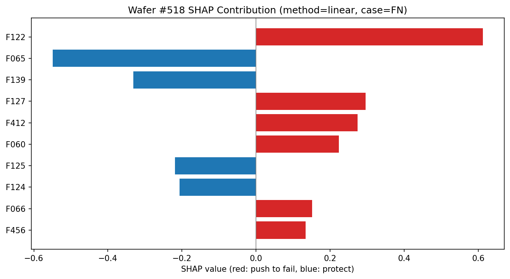
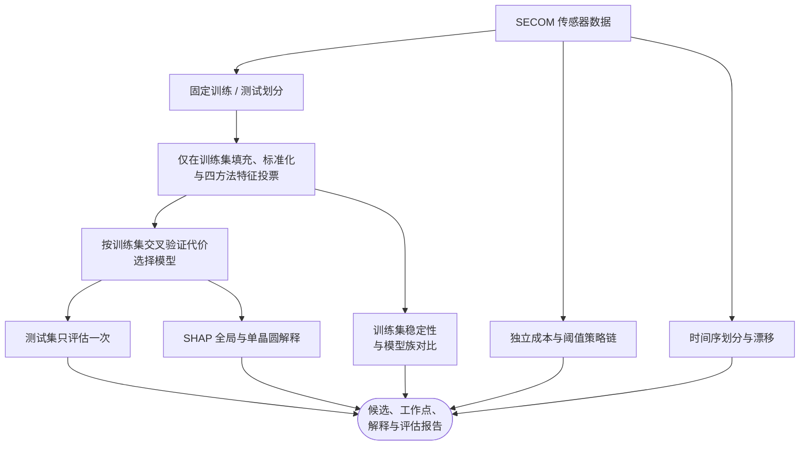

<div align="center">

# SECOM 半导体失效分析系统

**缩小排查范围，给出可复核的失效判定。**

面向半导体制造的离线失效预测与分析工具。把高维、类别不平衡的传感器读数，
转化为优先排查的参数候选、可复用的风险判定模型和单片晶圆的预测解释。

[](#4-快速启动)
[](#4-快速启动)
[](#1-项目背景)
[](LICENSE)

[快速启动](#4-快速启动) · [代表性结果](#3-代表性结果) · [功能与亮点](#2-功能与亮点) · [项目结构](#5-项目结构)

<p>
  
</p>

<sub>一片漏检晶圆：各参数对失效决策分数的正负贡献相互叠加，最终分数落在判定阈值以下。</sub>

</div>

以 UCI SECOM 数据集为例，包含 1567 片晶圆的匿名传感器读数及检测标签，其中 104 片失效，约占 6.64%。系统串联数据处理、特征筛选、风险预测、结果解释与离线验证，供方法研究、流程复现和工艺排查方案探索。

**从这里开始：** [安装与数据](#42-安装与数据准备) → [小样本试跑](#43-启动分析) → [代表性结果](#3-代表性结果)

## 1. 项目背景

半导体制造过程会留下大量传感器读数，而失效样本往往只占少数。分析时需要同时回答三个问题：

- **从哪里查起？** 高维数据伴随缺失值和相关特征，需要筛出值得优先复核的参数。
- **哪些晶圆值得复检？** 漏检失效与误报良品各有代价，需要把业务成本纳入风险判定。
- **结果能用到什么范围？** 样本划分和时间变化会影响模型表现，需要评估结论的稳定性与适用条件。

项目围绕这一高维、类别不平衡场景，将传感器数据转化为工艺与失效分析人员可直接使用的候选清单、风险工作点和单片解释，帮助缩小排查范围、安排复核顺序。

## 2. 功能与亮点

### 2.1 参数筛选：把排查范围缩小到候选清单

综合 F 检验、互信息、递归特征消除和随机森林四种方法，选出 40 个特征用于建模；再通过训练集内的重复采样，观察参数的入选频率与模型贡献方向是否稳定。

候选清单按“高稳定、探索性、当前证据不足”分档。本次 20 次采样得到 **9 项高稳定候选**，可优先进入工艺复核；其余参数保留为后续实验线索。这里的稳定性描述固定训练集与当前筛选方法下的统计表现。

### 2.2 风险决策：把漏检与误报的成本纳入模型

通过类别加权、采样调整和阈值选择等方式，比较捕获失效与增加复检之间的权衡。漏检（FN）指放过失效晶圆，误报（FP）指将良品列为风险样本；两者的相对成本在配置中统一设置。

交付的“工作点”包含整条已拟合处理链路、判定阈值和成本假设，加载时执行完整性与预测行为校验，便于复现同一套风险判定。成本策略使用独立的训练与评估链路。

### 2.3 单片解释：看清哪些参数影响了预测

使用 SHAP 分解主分析模型的预测依据，同时提供全局重要性与单片晶圆报告。开头图展示一片漏检样本：各参数对失效决策分数的正负贡献相互叠加，最终分数落在判定阈值以下。

该解释对应主分析中的岭分类器，贡献值使用决策分数尺度。报告为工艺复核提供统计关联线索，具体成因需结合现场知识与实验验证。

### 2.4 结果验证：同时关注重复性与时间变化

模型和策略依据训练侧验证选择，测试集用于独立评估。系统结合重复划分、模型配对比较和时间序对照，观察结果随样本变化的幅度；漂移分析进一步跟踪失败比例、传感器分布和早期模型在后续时段的表现。

配置、随机种子与依赖版本集中管理，验证脚本覆盖基线回归、报告重算和模型加载校验。当前训练侧配对比较保留岭分类器。

## 3. 代表性结果

### 3.1 随机评估与时间序对照

主要指标为**平衡错误率 BER**和**失效召回率**。
BER 是误报率与漏检率的平均值，越低越好。
召回率表示实际失效晶圆中被识别出的比例，越高越好。

以下并列展示同一模型类型——岭分类器——在两种评估方式下的表现：

| 评估方式 | BER | 失效召回率 |
| --- | --- | --- |
| 20 次随机分层划分 | 0.353 [0.245, 0.432] | 0.571 [0.381, 0.767] |
| 按时间先后划分 | 0.440 | 0.235 |

随机评估每次使用 80% 样本训练、20% 测试，表中为中位数与 5%–95% 经验分位，反映重复划分中的波动。时间序评估使用较早的 80% 样本训练、较晚的 20% 测试，测试段有 313 片晶圆、17 片失效；该协议按训练侧验证选出的模型为逻辑回归，表中岭分类器用于同名模型对照。

**时间序对照中的失效召回明显降低，跨时段验证是后续应用的重点。** 这一观察来自单次时间划分，其成因还需结合更充分的批次与工艺信息分析。

### 3.2 一个漏检与误报的权衡案例

在独立策略链路的一次固定随机留出中，测试集包含 314 片晶圆，其中 21 片失效。设漏检与误报的相对成本为 **10:1**，比较岭分类器的基础处理与类别加权：

| 处理方式 | 漏检 FN | 误报 FP | 相对代价（FN×10 + FP） |
| --- | ---: | ---: | ---: |
| 基础处理 | 21 | 0 | 210 |
| 类别加权 | 7 | 69 | 139 |

类别加权以增加良品复检为代价，将漏检从 21 片降至 7 片，按上述假设计算的相对代价降低约 34%。这个单次案例用于说明成本权衡；策略的跨时段表现仍需进一步验证。

## 4. 快速启动

### 4.1 环境要求

- **系统**：Linux 或 WSL，使用 Bash 执行验证脚本；模型在 CPU 上运行。
- **Python**：推荐 3.10，开发环境为 Python 3.10.12，需具备 `venv` 与 `pip`。
- **依赖**：NumPy 1.26.4、pandas 2.1.4、scikit-learn 1.3.2、SHAP 0.44.1 等，完整版本见 `requirements.txt`。

### 4.2 安装与数据准备

下载本仓库后，在包含 `main.py` 的仓库根目录创建并激活虚拟环境：

```bash
python3.10 -m venv .venv
source .venv/bin/activate
python -m pip install -r requirements.txt
```

在 UCI Machine Learning Repository 搜索 SECOM（数据集编号 179），下载并解压 `secom.data` 与 `secom_labels.data`，将两个文件放在仓库的**上一级目录**。如需使用其他位置，修改 `config.yaml` 中的 `data.features_path` 与 `data.labels_path`。

### 4.3 启动分析

先用 200 片分层抽样的小样本模式检查环境、数据与主入口：

```bash
python main.py --quick
```

再运行完整分析，生成预测评估、SHAP 解释、成本策略、消融对照、时间序评估与漂移报告：

```bash
python main.py
```

完整分析是小时级任务，耗时随硬件与配置变化。结果写入本地 `outputs/`，该目录由运行生成并已加入 Git 忽略规则。

### 4.4 分析与验证（可选）

候选稳定性与模型配对比较按需运行，后者复用前者的选择记录，请依次执行：

```bash
python -m src.stability_analysis
python -m src.model_comparison_analysis
```

复现重复划分区间时，将 `config.yaml` 中的 `validation.resample.enabled` 设为 `true`，再运行 `python main.py`。这些分析会增加计算时间，可通过相应模块的 `n_jobs` 配置调整并行度。

自动检查提供两种模式：`bash verify.sh` 检查依赖、配置、数据并运行小样本流程；`bash verify.sh full` 重新运行完整分析，再执行基线比对、产物校验与测试。建议在基础流程跑通后执行完整验证。

### 4.5 离线演示界面（可选）

本机只读展示 `docs/demo/` 中的结果快照，页签说明在界面内。启动：

```bash
python -m pip install -r requirements-demo.txt
python -m src.demo_app
```

浏览器访问 `http://127.0.0.1:7860`。默认只绑定本机、不创建公网链接。实时工作点预测还需要原始数据文件、`outputs/imbalance_operating_point_ridge.pkl` 及其清单。

## 5. 项目结构

系统按数据边界分成主分析链和几条独立验证链。填充、筛选和选型只在训练集上完成，测试集只评估一次。Gradio 演示只读取这些链已经落盘的快照，不另开分析路径。


```mermaid
flowchart TD
    A["SECOM 传感器数据"] --> B["固定训练 / 测试划分"]
    B --> C["仅在训练集填充、标准化<br/>与四方法特征投票"]
    C --> D["按训练集交叉验证代价<br/>选择模型"]
    D --> E["测试集只评估一次"]
    D --> F["SHAP 全局与单晶圆解释"]
    C --> G["训练集稳定性<br/>与模型族对比"]
    A --> H["独立成本与阈值策略链"]
    A --> I["时间序划分与漂移"]
    E --> J(["候选、工作点、<br/>解释与评估报告"])
    F --> J
    G --> J
    H --> J
    I --> J
```

- `main.py`：统一命令行入口。
- `config.yaml`、`requirements.txt`：运行配置与依赖版本。
- `requirements-demo.txt`：离线演示额外依赖（Gradio 及兼容的 FastAPI/Starlette）。
- `src/`：数据处理、特征筛选、模型训练、解释与验证模块；`src/pipeline.py` 负责流程编排。
- `src/demo_app.py`、`src/demo_views.py`、`src/demo_predict.py`、`src/demo_data.py`：本机演示界面、文案与工作点预测适配。
- `feature_map.yaml`：匿名特征到工艺含义的映射配置入口。
- `docs/demo/`：随仓库提供的示例图表与报告，供演示界面只读展示。
- `tests/`、`verify.sh`：自动化测试与端到端验证。
- `tools/`：本地产物维护工具。

## 6. 适用范围与扩展方向

当前系统面向带检测标签和时间信息的传感器数据，支持离线失效预测、统计归因、候选参数筛选与成本策略评估，适合方法研究、流程复现和工艺排查方案探索。结论对应当前数据、评估协议与成本设置；从统计候选走向工艺根因确认，需要现场知识与实验支持。

面向实际产线，可沿以下方向扩展：

- **现场数据适配**：将匿名参数映射到传感器、设备、腔室与工艺步骤，并确认实际漏检和复检成本。
- **跨批次与时间验证**：引入独立批次，开展扩展窗口评估，结合业务要求确定风险阈值与模型更新策略。
- **工程与分析能力**：建设在线监测、预警及处置闭环，结合因果实验、过程时序（trace）与晶圆空间分布（wafer map）深化失效分析。

## 7. 开源协议

本项目代码采用 MIT 许可证，许可全文见根目录 `LICENSE`。

UCI SECOM 数据集的使用与引用请遵循该数据集页面所列许可要求。
