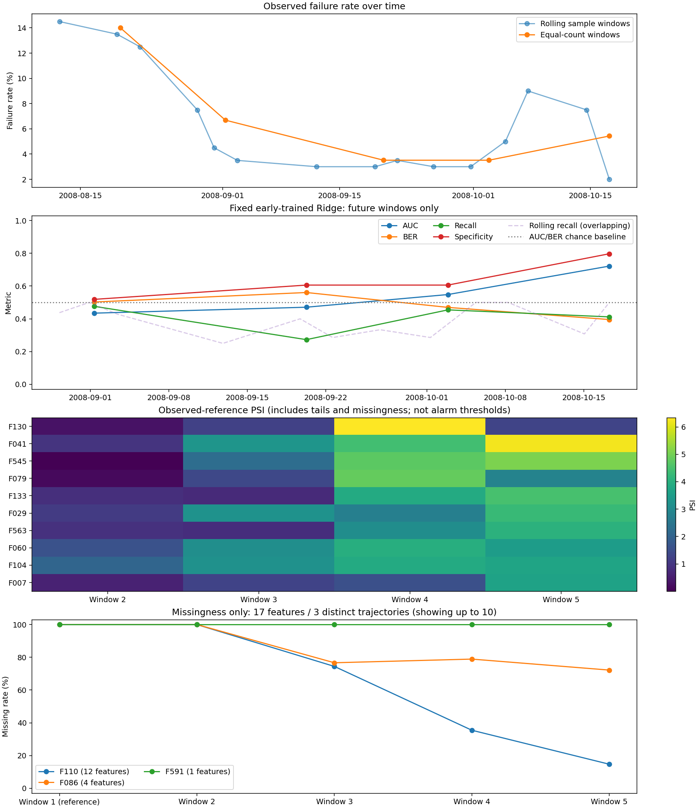

# 制程与良率的时间漂移分析

离线描述性分析，不是在线监控或工艺归因。
SECOM 样本通过率仅作良率代理，不代表全厂良率。

## 先验与样本通过率

时间跨度：2008-07-19 11:55:00 — 2008-10-17 06:07:00；1567 片，104 片失效，失败率 6.64%。
按时间稳定排序后用 numpy.array_split 等样本数分箱，并非等日历时长。

| 窗口 | 起止时间 | n | 失效 | 失败率 | 样本通过率 |
| --- | --- | ---: | ---: | ---: | ---: |
| 1 | 2008-07-19 11:55:00 — 2008-08-19 18:30:00 | 314 | 44 | 14.01% | 85.99% |
| 2 | 2008-08-19 18:30:00 — 2008-09-01 08:18:00 | 314 | 21 | 6.69% | 93.31% |
| 3 | 2008-09-01 09:06:00 — 2008-09-20 06:08:00 | 313 | 11 | 3.51% | 96.49% |
| 4 | 2008-09-20 07:21:00 — 2008-10-02 20:54:00 | 313 | 11 | 3.51% | 96.49% |
| 5 | 2008-10-02 21:32:00 — 2008-10-17 06:07:00 | 313 | 17 | 5.43% | 94.57% |

非零失败率最大/最小比 3.99；首窗占全部失效 42.31%。零失效窗口：[]（不纳入该比值，不能解读为无限倍已被估计）。

| 月份 | n | 失效 | 失败率 |
| --- | ---: | ---: | ---: |
| 2008-07 | 63 | 14 | 22.22% |
| 2008-08 | 555 | 51 | 9.19% |
| 2008-09 | 590 | 17 | 2.88% |
| 2008-10 | 359 | 22 | 6.13% |

另报 15 个样本滑窗：窗宽 200、步长 100，末窗对齐最后一行；不足一个窗时使用全部可用行。各窗起止时间、n、失败数与通过率均在 JSON 中。

## 原始特征分布

覆盖全部 591 个原始匿名特征；后续窗口分别对照第一窗。第一窗只是描述性参照，不是工程确认的健康基准。
PSI：参照窗 10 等分位区间、重复分位点合并；上下越界及缺失单独成桶，每桶加 0.5 伪计数后归一化。常量参照分为低于/等于/高于/缺失；全缺失参照仅能比较缺失率，不能估计未观测数值的漂移。
KS：各侧至少 2 个非缺失值；不足时记 N/A。全部 2296 个有效特征×窗口比较一起做 BH 校正。
KS 的 p/q 值仍受连续分布、独立观测假设约束；量化重复值、时间相关与特征相关使它们只能探索性阅读。不设 PSI/KS 报警阈值，不把高 PSI、低 p/q 或缺失率变化当成工艺因果证据。

有观测参照与全缺失参照分开展示，避免仅缺失率变化遮住其他分布变化；所有排序与合并只用于展示，不用于选特征或模型。

### 有观测参照：分位或常量基准

每窗展示本类 PSI 最高的 10 项；PSI 仍含尾部和缺失桶，不能把它解释为排除了缺失影响的纯数值漂移。

| 窗口 | 特征 | PSI 依据 | PSI | KS D | nominal p | BH q | 缺失率变化 |
| --- | --- | --- | ---: | ---: | ---: | ---: | ---: |
| 2 | F104 | 分位/尾部/缺失 | 2.0748 | 0.5414 | 0.000000 | 0.000000 | +0.00% |
| 2 | F123 | 分位/尾部/缺失 | 1.9017 | 0.4089 | 0.000000 | 0.000000 | -1.27% |
| 2 | F291 | 分位/尾部/缺失 | 1.8905 | 0.4552 | 0.000000 | 0.000000 | -2.87% |
| 2 | F127 | 分位/尾部/缺失 | 1.7898 | 0.3767 | 0.000000 | 0.000000 | -1.27% |
| 2 | F060 | 分位/尾部/缺失 | 1.6094 | 0.4896 | 0.000000 | 0.000000 | +0.64% |
| 2 | F059 | 分位/尾部/缺失 | 1.4244 | 0.5468 | 0.000000 | 0.000000 | -0.64% |
| 2 | F039 | 分位/尾部/缺失 | 1.4208 | 0.3117 | 0.000000 | 0.000000 | +0.32% |
| 2 | F129 | 分位/尾部/缺失 | 1.3859 | 0.3546 | 0.000000 | 0.000000 | -1.27% |
| 2 | F541 | 分位/尾部/缺失 | 1.2769 | 0.3860 | 0.000000 | 0.000000 | -1.59% |
| 2 | F269 | 分位/尾部/缺失 | 1.2769 | 0.3860 | 0.000000 | 0.000000 | -1.59% |
| 3 | F291 | 分位/尾部/缺失 | 3.4156 | 0.6439 | 0.000000 | 0.000000 | -2.55% |
| 3 | F041 | 分位/尾部/缺失 | 3.2947 | 0.5254 | 0.000000 | 0.000000 | +0.32% |
| 3 | F029 | 分位/尾部/缺失 | 3.2325 | 0.5461 | 0.000000 | 0.000000 | +0.32% |
| 3 | F104 | 分位/尾部/缺失 | 3.2038 | 0.6622 | 0.000000 | 0.000000 | +0.00% |
| 3 | F060 | 分位/尾部/缺失 | 3.1370 | 0.6144 | 0.000000 | 0.000000 | +0.64% |
| 3 | F123 | 分位/尾部/缺失 | 3.1032 | 0.3528 | 0.000000 | 0.000000 | -1.59% |
| 3 | F128 | 分位/尾部/缺失 | 2.8266 | 0.3480 | 0.000000 | 0.000000 | -1.59% |
| 3 | F429 | 分位/尾部/缺失 | 2.6037 | 0.6294 | 0.000000 | 0.000000 | -2.55% |
| 3 | F469 | 分位/尾部/缺失 | 2.4441 | 0.4780 | 0.000000 | 0.000000 | +0.64% |
| 3 | F156 | 分位/尾部/缺失 | 2.3796 | 0.6051 | 0.000000 | 0.000000 | -2.55% |
| 4 | F130 | 分位/尾部/缺失 | 6.3378 | 0.7827 | 0.000000 | 0.000000 | -1.59% |
| 4 | F079 | 分位/尾部/缺失 | 4.8473 | 0.8245 | 0.000000 | 0.000000 | +0.00% |
| 4 | F545 | 分位/尾部/缺失 | 4.7314 | 0.5911 | 0.000000 | 0.000000 | +0.00% |
| 4 | F041 | 分位/尾部/缺失 | 4.4206 | 0.5509 | 0.000000 | 0.000000 | +1.92% |
| 4 | F060 | 分位/尾部/缺失 | 3.9718 | 0.6685 | 0.000000 | 0.000000 | +0.96% |
| 4 | F104 | 分位/尾部/缺失 | 3.8769 | 0.7158 | 0.000000 | 0.000000 | +0.64% |
| 4 | F133 | 分位/尾部/缺失 | 3.8677 | 0.5461 | 0.000000 | 0.000000 | -1.59% |
| 4 | F546 | 分位/尾部/缺失 | 3.3360 | 0.6422 | 0.000000 | 0.000000 | +0.00% |
| 4 | F081 | 分位/尾部/缺失 | 3.2787 | 0.5096 | 0.000000 | 0.000000 | +0.00% |
| 4 | F563 | 分位/尾部/缺失 | 3.1139 | 0.3883 | 0.000000 | 0.000000 | -29.93% |
| 5 | F041 | 分位/尾部/缺失 | 6.2276 | 0.7374 | 0.000000 | 0.000000 | -1.59% |
| 5 | F545 | 分位/尾部/缺失 | 5.0983 | 0.6849 | 0.000000 | 0.000000 | +0.64% |
| 5 | F133 | 分位/尾部/缺失 | 4.4822 | 0.7836 | 0.000000 | 0.000000 | -0.63% |
| 5 | F029 | 分位/尾部/缺失 | 4.2682 | 0.6843 | 0.000000 | 0.000000 | +0.00% |
| 5 | F563 | 分位/尾部/缺失 | 4.0780 | 0.4252 | 0.000000 | 0.000000 | -31.85% |
| 5 | F104 | 分位/尾部/缺失 | 3.7065 | 0.7066 | 0.000000 | 0.000000 | +0.00% |
| 5 | F007 | 分位/尾部/缺失 | 3.6423 | 0.4484 | 0.000000 | 0.000000 | +1.92% |
| 5 | F248 | 分位/尾部/缺失 | 3.5210 | 0.6661 | 0.000000 | 0.000000 | +72.27% |
| 5 | F060 | 分位/尾部/缺失 | 3.5092 | 0.6432 | 0.000000 | 0.000000 | +0.00% |
| 5 | F520 | 分位/尾部/缺失 | 3.4786 | 0.6580 | 0.000000 | 0.000000 | +72.27% |

### 全缺失参照：仅缺失率

共 17 列，按各评估窗完全相同的缺失率轨迹合并为 3 组；按跨窗最大 PSI 展示前 10 组。代表列和组内列数仅作去重展示，JSON 保留全部原始列与统计值。

| 窗口 | 代表列 | PSI 依据 | 同轨迹列数 | PSI | 参照缺失率 | 当前缺失率 | 缺失率变化 |
| --- | --- | --- | ---: | ---: | ---: | ---: | ---: |
| 2 | F110 | 仅缺失率 | 12 | 0.0000 | 100.00% | 100.00% | +0.00% |
| 2 | F086 | 仅缺失率 | 4 | 0.0000 | 100.00% | 100.00% | +0.00% |
| 2 | F591 | 仅缺失率 | 1 | 0.0000 | 100.00% | 100.00% | +0.00% |
| 3 | F110 | 仅缺失率 | 12 | 1.3705 | 100.00% | 74.44% | -25.56% |
| 3 | F086 | 仅缺失率 | 4 | 1.2226 | 100.00% | 76.68% | -23.32% |
| 3 | F591 | 仅缺失率 | 1 | 0.0000 | 100.00% | 100.00% | +0.00% |
| 4 | F110 | 仅缺失率 | 12 | 4.5295 | 100.00% | 35.46% | -64.54% |
| 4 | F086 | 仅缺失率 | 4 | 1.0783 | 100.00% | 78.91% | -21.09% |
| 4 | F591 | 仅缺失率 | 1 | 0.0000 | 100.00% | 100.00% | +0.00% |
| 5 | F110 | 仅缺失率 | 12 | 6.9674 | 100.00% | 14.70% | -85.30% |
| 5 | F086 | 仅缺失率 | 4 | 1.5220 | 100.00% | 72.20% | -27.80% |
| 5 | F591 | 仅缺失率 | 1 | 0.0000 | 100.00% | 100.00% | +0.00% |

## 固定早期模型的未来性能

固定 ridge + class_weight，默认决策边界；不校准、不调阈值、不重选模型。仅第一窗候选 314 行用于训练；剔除 1 行边界同时间戳后，实际训练 313 行（44 片失效）。
训练时段 2008-07-19 11:55:00 — 2008-08-19 18:12:00；填充、缩放和特征选择只拟合这些行，全部评估行的 timestamp 严格更晚。
选出 40 个特征，一次拟合后在后续 1253 行预测。分数空间为 decision_margin，不是概率。
首窗不报训练内性能；不复用可能见过未来晶圆的随机划分交付模型。这是更小早期训练窗的另一协议，不能和前 80% 训练的时间序对照或随机协议直接配对。

| 评估窗 | n | 失效 | TN / FP / FN / TP | AUC | BER | 召回 | 特异度 | 每片代价 |
| --- | ---: | ---: | --- | ---: | ---: | ---: | ---: | ---: |
| 2 | 314 | 21 | 152 / 141 / 11 / 10 | 0.4346 | 0.5025 | 0.4762 | 0.5188 | 0.7994 |
| 3 | 313 | 11 | 183 / 119 / 8 / 3 | 0.4708 | 0.5607 | 0.2727 | 0.6060 | 0.6358 |
| 4 | 313 | 11 | 183 / 119 / 6 / 5 | 0.5482 | 0.4697 | 0.4545 | 0.6060 | 0.5719 |
| 5 | 313 | 17 | 236 / 60 / 10 / 7 | 0.7220 | 0.3955 | 0.4118 | 0.7973 | 0.5112 |
| all_future | 1253 | 60 | 754 / 439 / 35 / 25 | 0.5431 | 0.4757 | 0.4167 | 0.6320 | 0.6297 |

随机排序的 AUC 基线为 0.5，标签独立预测的 BER 基线为 0.5；AUC 越高、BER 越低越好。这些是点估计，不是与随机基线的显著性检验。
其中 窗口 2 AUC=0.4346、BER=0.5025；窗口 3 AUC=0.4708、BER=0.5607：AUC 点估计低于随机排序基线，不能把后续窗口的改善解读为模型已可用。早期训练样本少、特征多只是背景，不能据此把低分归因于训练规模或漂移。

成本假设 FN=10 / FP=1；JSON 另含 12 个仅未来样本的滑窗、逐行预测、分数及训练状态。
缺正类时召回不可定义，缺负类时特异度不可定义；任一类别缺失时 BER/AUC 为 null。小窗口只有少量失效，单片即可显著改变召回；曲线不是性能区间，也不保证单调下降。

## 边界与复核

- 窗口重叠，不是独立重复实验；不把 KS/BH 当成控制限，不构造跨协议配对区间。
- 先验、特征与性能共同变化不构成归因；缺少 lot / 设备 / 腔室 / recipe 标识。
- 原始数据、配置、源码指纹与逐行预测保存在 JSON；验收会重新拟合早期链路并重算图文。
- 数据 SHA-256：`16bc6fdda57a78ef090b0803d5961a4fc8b0dc8c018c4e779a17d34d9431a71a`。
